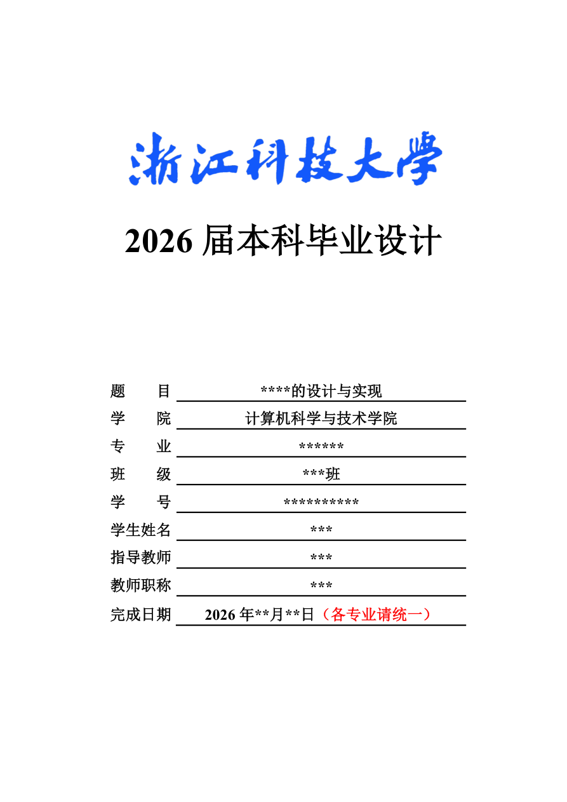
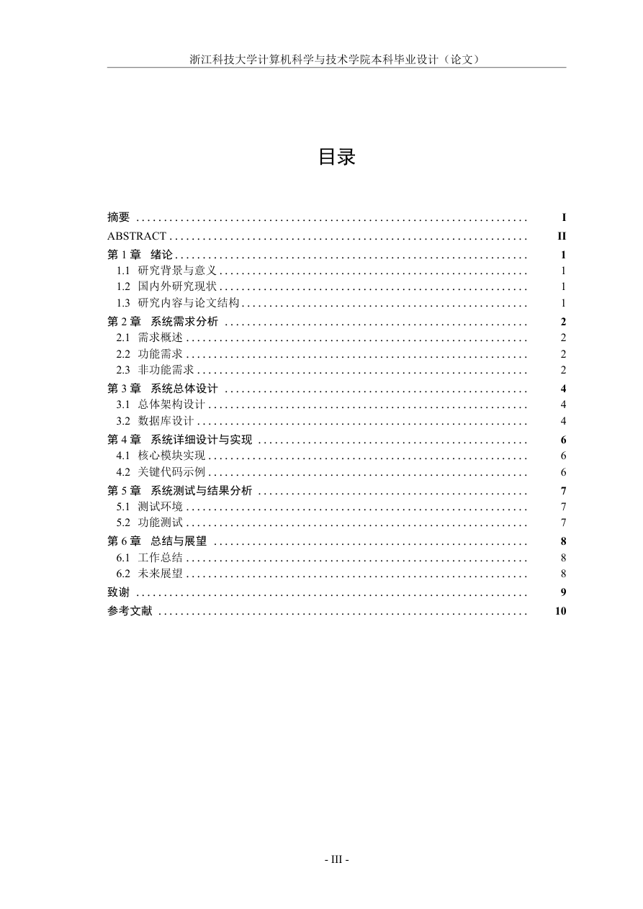
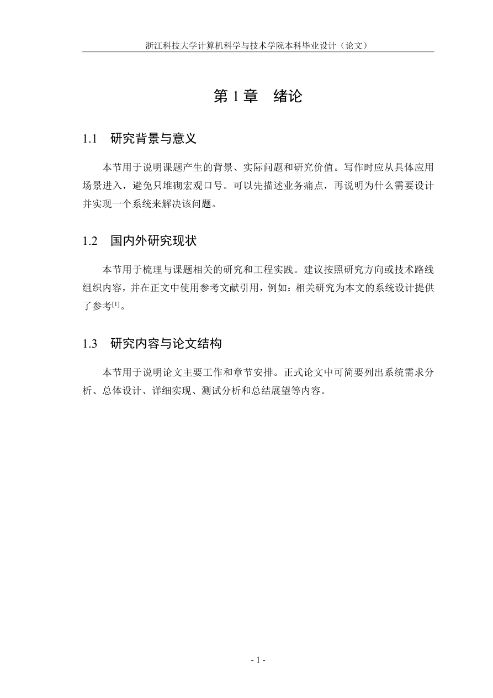

# ZUST 计算机学院本科毕业设计（论文）LaTeX 模板

这是一个面向浙江科技大学计算机学院本科毕业设计（论文）的 LaTeX 模板。模板已经内置学校固定页、正文页眉页脚、摘要、目录、章节标题、图表、代码块、Mermaid 图和截图占位等常用结构。

如果你从来没有写过 LaTeX，也可以按本文档一步一步操作。建议先不要改样式，先把模板编译成功，再逐步替换自己的论文内容。

## 效果预览

以下图片由模板当前输出的 `main.pdf` 导出，展示封面、目录和正文页的大致效果。

| 封面 | 目录 | 正文 |
| --- | --- | --- |
|  |  |  |

## 这个模板能做什么

- 自动生成最终论文 PDF：`main.pdf`。
- 自动生成 Word 审阅版 DOCX：`dist/毕业设计论文.docx` 或 `dist/<论文题目>.docx`，默认以最终 PDF 为输入进行转换。
- 使用学校提供的 Word 固定页作为封面、出版授权书、版权使用授权书。
- 自动把 `frontmatter/*.docx` 和 `frontmatter/*.doc` 导出为 PDF 并合并进论文。
- 自动把 `figures/mermaid/*.mmd` 渲染成 PDF 图片。
- 生成 DOCX 时优先从 `main.pdf` 转换，尽量保持分页、空白、固定页和图表外观与 PDF 一致。
- 截图文件不存在时，正文会先显示截图占位框，方便你后续补图。
- 同时提供 PowerShell 脚本和 Bash 脚本，Windows、macOS、Linux 都能走基本构建流程。
- 字体配置带有 fallback：Windows 优先宋体/黑体，macOS 优先 Songti/Heiti，Linux 优先 Noto/Fandol。
- 保留一个干净的通用论文结构，不包含学生个人信息和真实论文正文。

## 目录结构

```text
.
├── main.tex                  # 论文入口，填写封面信息，组织各章节
├── zustcs-thesis.cls          # 学校论文格式类文件，一般不要改
├── chapters/
│   ├── abstract-cn.tex        # 中文摘要
│   ├── abstract-en.tex        # 英文摘要
│   ├── body.tex               # 正文入口，按章引入 chapters/body/*.tex
│   ├── body/                  # 正文章节拆分目录
│   ├── acknowledgements.tex   # 致谢
│   └── references.tex         # 参考文献
├── frontmatter/
│   ├── cover.docx             # 学校官方封面 Word 模板
│   ├── authorization.doc      # 学位论文出版授权书
│   ├── copyright.doc          # 版权使用授权书
│   └── frontmatter.json       # 固定页导出清单
├── figures/
│   ├── mermaid/               # Mermaid 图源码
│   ├── generated/             # Mermaid 渲染后的 PDF
│   └── screenshots/           # 软件截图
├── scripts/
│   ├── build.ps1              # Windows 一键构建
│   ├── build.sh               # macOS/Linux 一键构建
│   ├── build-docx.mjs         # 旧版 Pandoc 转换脚本，默认流程不再使用
│   ├── build-docx.ps1         # 先生成 PDF，再将 PDF 转为 DOCX
│   ├── build-docx.sh          # macOS/Linux 调用 PowerShell 版 DOCX 构建
│   ├── build-body.ps1         # 只编译正文部分
│   ├── build-body.sh          # macOS/Linux 调用 PowerShell 版正文构建
│   ├── clean.ps1              # Windows 清理临时文件
│   ├── clean.sh               # macOS/Linux 清理临时文件
│   ├── export-frontmatter.ps1 # Windows 使用 Word 导出固定页
│   ├── export-frontmatter.sh  # macOS/Linux 使用 LibreOffice 导出固定页
│   ├── render-mermaid.ps1     # Windows Mermaid 渲染
│   ├── render-mermaid.sh      # macOS/Linux Mermaid 渲染
│   ├── sync-markdown.ps1      # 从 LaTeX 源同步生成 Markdown 审阅稿
│   ├── run-xelatex.ps1        # Windows latexmk 调用的 XeLaTeX 包装脚本
│   └── run-xelatex.sh         # macOS/Linux latexmk 调用的 XeLaTeX 包装脚本
└── .latexmkrc                 # latexmk 配置
```

## 从 0 开始：先准备环境

本模板支持 Windows、macOS 和 Linux。不同系统的主要差别在固定页导出：Windows 使用 Microsoft Word，macOS/Linux 使用 LibreOffice。

如果你已经安装过 LaTeX、Node.js 和固定页导出工具，可以直接跳到“获取模板”。

### 1. 安装固定页导出工具

固定页来自学校 Word 模板。构建脚本会调用 Word 把 `frontmatter/cover.docx`、`frontmatter/authorization.doc`、`frontmatter/copyright.doc` 导出成 PDF。

Windows 推荐安装 Microsoft Word。学校模板本来就是 Word 文件，Word 导出的版式最稳。

macOS 可以安装 LibreOffice：

```bash
brew install --cask libreoffice
```

Linux 可以安装 LibreOffice：

```bash
sudo apt install libreoffice
```

这里需要特别说明：LibreOffice 能完成自动导出，但 Word 文档在不同软件中的排版可能有轻微差异。正式提交前，如果学校对固定页格式要求很严格，建议最后仍在 Windows + Microsoft Word 环境完整构建并检查一次。

### 2. 安装 LaTeX

Windows 推荐 MiKTeX。macOS 推荐 MacTeX。Linux 推荐 TeX Live。

Windows 如果使用 Scoop，可以执行：

```powershell
scoop install miktex perl
```

macOS 如果使用 Homebrew，可以执行：

```bash
brew install --cask mactex
```

Linux 以 Ubuntu/Debian 为例：

```bash
sudo apt install texlive-xetex texlive-latex-extra latexmk fonts-noto-cjk
```

安装后打开一个新的终端或 PowerShell，检查命令是否可用：

```bash
xelatex --version
latexmk --version
```

如果 `latexmk` 不存在，需要补装 `latexmk` 或 Perl。模板使用 `latexmk` 做多轮编译，它会自动处理目录、页码和交叉引用。

### 3. 安装 Node.js

Node.js 用于渲染 Mermaid 图，也用于 DOCX 构建脚本的通用预处理。如果你只编译 PDF 且不使用 Mermaid，可以暂时跳过；如果要生成 DOCX，建议安装。

如果你使用 Scoop，可以执行：

```powershell
scoop install nodejs-lts
```

macOS 如果使用 Homebrew：

```bash
brew install node
```

Linux 以 Ubuntu/Debian 为例：

```bash
sudo apt install nodejs npm
```

然后检查：

```bash
node --version
npx --version
```

构建脚本会通过 `npx --yes @mermaid-js/mermaid-cli` 自动调用 Mermaid CLI，不需要你手动全局安装 Mermaid。

### 4. 安装 PDF 转 DOCX 依赖

DOCX 现在默认从最终 `main.pdf` 转换得到。Windows 上优先使用 Microsoft Word 的 PDF 导入功能；如果本机 Word 不支持 PDF 导入，脚本会回退到 Python `pdf2docx`。

安装 Python 依赖：

```powershell
python -m pip install pdf2docx pymupdf opencv-python-headless
```

如果你使用 Adobe Acrobat、在线工具或学校指定工具转换出更高保真的 DOCX，也可以通过 `-ReferenceDocxPath` 提供给脚本。脚本会检查页数，只有页数与 PDF 一致时才采用该文件。

### 5. 允许脚本运行

Windows 如果运行 `.\scripts\build.ps1` 时提示“无法加载文件，因为在此系统上禁止运行脚本”，在当前用户范围内放开本地脚本执行权限：


```powershell
Set-ExecutionPolicy -Scope CurrentUser RemoteSigned
```

执行后重新打开 PowerShell，再进入模板目录构建。

macOS/Linux 如果脚本没有执行权限，执行：

```bash
chmod +x scripts/*.sh
```

## 获取模板

如果模板已经在你的电脑上，直接进入模板目录即可。

如果模板在 Git 仓库中，使用：

```bash
git clone <仓库地址> zust-cs-thesis-template
cd zust-cs-thesis-template
```

如果你拿到的是压缩包，先解压，然后在终端或 PowerShell 中进入解压后的目录：

```bash
cd path\to\zust-cs-thesis-template
```

## 第一次编译

进入模板目录：

```bash
cd path\to\zust-cs-thesis-template
```

Windows 运行：

```powershell
.\scripts\build.ps1
```

macOS/Linux 运行：

```bash
./scripts/build.sh
```

成功后会生成：

```text
main.pdf
```

第一次构建可能比较慢，因为 MiKTeX 可能会自动安装缺失的 LaTeX 宏包，`npx` 也可能会临时下载 Mermaid CLI。

## 生成 DOCX 审阅版

PDF 是最终提交版式，DOCX 更适合发给导师批注或自己在 Word 中做临时修改。为了让 Word 版尽量贴近 PDF，模板不再用 Pandoc 重新排版正文，而是先生成 `main.pdf`，再把 PDF 转成 DOCX。

Windows 运行：

```powershell
.\scripts\build-docx.ps1
```

macOS/Linux 运行：

```bash
./scripts/build-docx.sh
```

默认输出位置：

```text
dist/毕业设计论文.docx
```

如果你已经把 `main.tex` 中的题目从“请在此填写毕业设计（论文）题目”改成真实题目，默认文件名会变成：

```text
dist/<论文题目>.docx
```

脚本会先运行 PDF 构建，再执行 PDF 转 DOCX。转换完成后会统计 Word 页数，并与 PDF 页数比较。如果页数不一致，脚本会报错；你可以使用 `-ReferenceDocxPath` 指定一份由在线工具、Adobe Acrobat 或其他高保真工具转换得到的 DOCX 作为后备。

常用参数：

```powershell
# Windows：PDF 已经是最新时，跳过 PDF 编译，直接转换
.\scripts\build-docx.ps1 -SkipPdfBuild

# Windows：跳过 Mermaid 渲染，复用已有图片
.\scripts\build-docx.ps1 -SkipMermaid

# Windows：指定输出文件
.\scripts\build-docx.ps1 -OutputPath dist\review.docx

# Windows：指定高保真 PDF 转 Word 结果作为后备
.\scripts\build-docx.ps1 -ReferenceDocxPath ..\main.docx
```

macOS/Linux 通过 `build-docx.sh` 调用同一套 PowerShell 流程，因此需要安装 PowerShell 7。需要注意：DOCX 转换结果取决于本机 PDF 转 Word 工具。正式提交仍应检查 `main.pdf`。

## 推荐写作顺序

不要一开始就改格式文件。建议按下面顺序写：

1. 先运行 `.\scripts\build.ps1` 或 `./scripts/build.sh`，确认空模板能生成 `main.pdf`。
2. 修改 `main.tex` 中的封面字段。
3. 修改 `frontmatter/` 里的学校固定页 Word 文件。
4. 写中文摘要和英文摘要。
5. 按章节替换 `chapters/body/` 下的正文文件。
6. 放入系统截图和 Mermaid 图。
7. 整理参考文献。
8. 最后完整编译并检查 PDF。

## 修改封面和固定页

### 1. 修改 `main.tex`

打开 `main.tex`，找到：

```tex
\makethesiscover
  {请在此填写毕业设计（论文）题目}
  {请填写学院名称}
  {请填写专业名称}
  {请填写班级}
  {请填写学号}
  {请填写学生姓名}
  {请填写指导教师}
  {请填写教师职称}
  {请填写完成日期}
```

把占位文字改成自己的信息。例如：

```tex
\makethesiscover
  {某某系统的设计与实现}
  {计算机科学与技术学院}
  {软件工程}
  {软件工程XXXX}
  {XXXXXXXXXX}
  {张三}
  {李四}
  {讲师}
  {2026年5月}
```

这里的信息主要用于没有固定页 PDF 时的备用封面。正式提交时，建议同时修改 `frontmatter/cover.docx`，因为学校固定页以 Word 模板导出的 PDF 为准。

### 2. 修改 `frontmatter/` 里的 Word 文件

打开这些文件，按学校要求填写个人信息：

```text
frontmatter/cover.docx
frontmatter/authorization.doc
frontmatter/copyright.doc
```

不要随意改动固定页的字体、缩进、段落、签名位置和页面顺序。只填写必要字段。

修改后重新构建：

Windows：

```powershell
.\scripts\build.ps1 -ForceFrontmatter
```

macOS/Linux：

```bash
./scripts/build.sh --force-frontmatter
```

该参数会强制重新导出固定页 PDF。

## 写摘要

中文摘要在：

```text
chapters/abstract-cn.tex
```

英文摘要在：

```text
chapters/abstract-en.tex
```

中文摘要示例结构：

```tex
\abstractparagraph{第一段写研究背景、问题和目标。}

\abstractparagraph{第二段写系统设计、主要技术和实现结果。}

\keywords{关键词一；关键词二；关键词三；关键词四}
```

摘要不要写成“第 1 章介绍了什么”。摘要应直接概括你的工作：为什么做、做了什么、怎么做、结果如何。

## 写正文

正文入口文件是：

```text
chapters/body.tex
```

实际章节文件放在：

```text
chapters/body/
```

模板已经给出常见本科论文结构：

```text
第1章 绪论
第2章 系统需求分析
第3章 系统总体设计
第4章 系统详细设计与实现
第5章 系统测试与结果分析
第6章 总结与展望
```

你可以直接替换每一节的占位文字。常用命令如下：

```tex
\chapter{系统需求分析}
\section{功能需求}
\subsection{用户管理需求}
```

第 4 章通常应写得最详细。建议每个核心模块至少包含：

```text
模块用途
业务流程
关键页面截图
核心实现说明
必要的代码片段
测试或运行结果
```

如果只想检查正文部分，可以运行：

```powershell
.\scripts\build-body.ps1 -SkipMermaid
```

该命令会生成 `main-body.pdf`，不包含封面、摘要、目录、致谢和参考文献列表，适合快速检查正文分页和图表位置。

## 插入图片

普通图片可以放到：

```text
figures/screenshots/
```

然后在正文中使用：

```tex
\begin{figure}[H]
\centering
\includegraphics[width=0.85\textwidth]{figures/screenshots/example.png}
\caption{示例页面}
\label{fig:example}
\end{figure}
```

引用图片时写：

```tex
如图~\ref{fig:example} 所示，系统页面包括查询区和数据列表。
```

## 使用截图占位

模板提供了截图占位命令：

```tex
\renderscreenshot{4-1}{screenshot-module-page.png}{核心功能页面截图占位}{请填写页面或功能来源}
```

含义如下：

```text
4-1                         # 图编号标签的一部分
screenshot-module-page.png  # 需要放入 figures/screenshots/ 的文件名
核心功能页面截图占位        # 图题
请填写页面或功能来源        # 占位框里显示的说明
```

当 `figures/screenshots/screenshot-module-page.png` 不存在时，PDF 中会显示占位框。当你把同名截图放进去后，重新编译即可自动替换成真实截图。

## 使用 Mermaid 图

Mermaid 源文件放在：

```text
figures/mermaid/
```

例如：

```text
figures/mermaid/fig-3-1.mmd
```

构建时会自动生成：

```text
figures/generated/fig-3-1.pdf
```

正文中可以这样写：

```tex
\begin{figure}[H]
\centering
\rendermermaid{fig-3-1}{0.50\textheight}
\caption{系统总体架构}
\label{fig:3-1}
\end{figure}
```

如果 Mermaid 渲染失败，模板会退回显示 `.mmd` 源码，方便你先继续写正文。正式提交前建议确保 Mermaid 图已经渲染为 PDF。

强制重新渲染 Mermaid：

Windows：

```powershell
.\scripts\build.ps1 -ForceMermaid
```

macOS/Linux：

```bash
./scripts/build.sh --force-mermaid
```

生成 DOCX 时，脚本会额外生成同名 PNG：

```text
figures/generated/fig-3-1.png
```

这些 PNG 是可再生构建产物，默认不纳入 Git 跟踪。

## 写表格

简单表格可以参考 `chapters/body/03-system-design.tex` 中的 `longtable` 示例。字段较多时，建议不要把表格写得太宽。可以把字段拆成“表名、主要字段、说明”三列，或者把大表拆成多个小表。

表格引用示例：

```tex
如表~\ref{tab:3-1} 所示，系统核心数据表包括用户表、业务记录表和操作日志表。
```

## 写代码片段

代码片段用于说明关键逻辑，不要把整个项目源码都贴进论文。

```tex
\begin{lstlisting}[style=thesiscode,language=python]
def validate_status(status: str) -> bool:
    allowed = {"draft", "processing", "finished"}
    return status in allowed
\end{lstlisting}
```

如果代码里有下划线、反斜杠、百分号等特殊字符，优先放在 `lstlisting` 环境里，少直接写在正文里。

## 写参考文献

参考文献在：

```text
chapters/references.tex
```

示例：

```tex
\bibitem{ref1} 作者. 文献题名[J]. 期刊名, 年份, 卷(期): 起止页码.
\bibitem{ref2} Author A, Author B. Article title[J]. Journal Name, Year, Volume(Issue): pages.
```

正文引用：

```tex
相关研究为本文系统架构设计提供了参考\cite{ref1}。
```

建议用 Zotero 管理文献，再把最终参考文献条目整理到 `references.tex`。不要编造文献，不确定的文献不要放进最终稿。

## 常用构建命令

完整构建：

Windows：

```powershell
.\scripts\build.ps1
```

macOS/Linux：

```bash
./scripts/build.sh
```

强制重新导出固定页：

Windows：

```powershell
.\scripts\build.ps1 -ForceFrontmatter
```

macOS/Linux：

```bash
./scripts/build.sh --force-frontmatter
```

强制重新渲染 Mermaid：

Windows：

```powershell
.\scripts\build.ps1 -ForceMermaid
```

macOS/Linux：

```bash
./scripts/build.sh --force-mermaid
```

只编译 LaTeX，不导出固定页、不渲染 Mermaid：

Windows：

```powershell
.\scripts\build.ps1 -SkipFrontmatter -SkipMermaid
```

macOS/Linux：

```bash
./scripts/build.sh --skip-frontmatter --skip-mermaid
```

清理临时文件：

Windows：

```powershell
.\scripts\clean.ps1
```

macOS/Linux：

```bash
./scripts/clean.sh
```

清理脚本不会删除 `main.pdf`、Word 源文件或图片资源。

生成 DOCX：

Windows：

```powershell
.\scripts\build-docx.ps1
```

macOS/Linux：

```bash
./scripts/build-docx.sh
```

只编译正文：

Windows：

```powershell
.\scripts\build-body.ps1 -SkipMermaid
```

macOS/Linux：

```bash
./scripts/build-body.sh -SkipMermaid
```

从 LaTeX 源同步生成 Markdown 审阅稿：

```powershell
.\scripts\sync-markdown.ps1
```

## 常见问题

### 1. 提示 `latexmk not found`

说明没有安装 `latexmk`，或者命令没有进入 PATH。先检查：

```bash
latexmk --version
```

如果不可用，安装 MiKTeX/TeX Live，并确认 Perl 和 latexmk 可用。

### 2. 提示 `xelatex not found`

说明 LaTeX 没装好，或者 PATH 没生效。重新打开终端或 PowerShell 后再检查：

```bash
xelatex --version
```

### 3. 固定页没有更新

如果你改了 Word 文件，但 PDF 里没变化，执行：

Windows：

```powershell
.\scripts\build.ps1 -ForceFrontmatter
```

macOS/Linux：

```bash
./scripts/build.sh --force-frontmatter
```

同时确认 Word 文件已经保存并关闭。

### 4. Mermaid 图没有生成

先检查：

```bash
node --version
npx --version
```

然后强制重新渲染：

Windows：

```powershell
.\scripts\build.ps1 -ForceMermaid
```

macOS/Linux：

```bash
./scripts/build.sh --force-mermaid
```

如果仍失败，先检查 `.mmd` 文件语法。可以临时让正文显示 Mermaid 源码，但正式提交前应生成真实图片。

### 5. 图片不显示

检查图片路径是否正确。LaTeX 路径建议使用 `/`：

```tex
figures/screenshots/example.png
```

不要写成：

```tex
figures\screenshots\example.png
```

### 6. 中文字体报错

模板会自动尝试多组字体。Windows 优先使用宋体、黑体、仿宋、Times New Roman；macOS 会尝试 Songti SC、Heiti SC；Linux 会尝试 Noto CJK 或 Fandol 字体。如果 Linux 中文字体缺失，安装：

```bash
sudo apt install fonts-noto-cjk
```

### 7. PDF 页码或目录不对

重新运行：

Windows：

```powershell
.\scripts\build.ps1
```

macOS/Linux：

```bash
./scripts/build.sh
```

`latexmk` 会自动多轮编译。不要只运行一次 `xelatex`。

## 提交前检查清单

正式提交前建议逐项检查：

```text
封面信息是否正确
授权书和版权页是否填写并保留学校格式
中文摘要和英文摘要是否完整
关键词是否规范
目录页码是否正确
正文是否仍有“请填写”“占位”“示例”等文字
图题、表题和正文引用是否一致
截图是否全部替换为真实截图
Mermaid 图是否已经渲染为 PDF
参考文献是否真实可查
致谢是否已经替换成个人内容
最终 PDF 是否能正常打开
```

## 不建议修改的文件

初学者通常不需要改这些文件：

```text
zustcs-thesis.cls
.latexmkrc
scripts/run-xelatex.ps1
scripts/run-xelatex.sh
scripts/export-frontmatter.ps1
scripts/export-frontmatter.sh
```

如果只是写论文，主要修改：

```text
main.tex
chapters/*.tex
chapters/body/*.tex
frontmatter/*.docx
frontmatter/*.doc
figures/mermaid/*.mmd
figures/screenshots/*
```

## 最小工作流

如果你只想快速开始，可以记住这 5 步：

Windows：

```powershell
# 1. 进入模板目录
cd path\to\zust-cs-thesis-template

# 2. 先编译一次，确认环境可用
.\scripts\build.ps1

# 3. 修改 main.tex、chapters/*.tex、chapters/body/*.tex 和 frontmatter/*.docx

# 4. 放入截图和 Mermaid 图

# 5. 再次生成最终 PDF
.\scripts\build.ps1 -ForceFrontmatter -ForceMermaid
```

macOS/Linux：

```bash
# 1. 进入模板目录
cd path/to/zust-cs-thesis-template

# 2. 先编译一次，确认环境可用
./scripts/build.sh

# 3. 修改 main.tex、chapters/*.tex、chapters/body/*.tex 和 frontmatter/*.docx

# 4. 放入截图和 Mermaid 图

# 5. 再次生成最终 PDF
./scripts/build.sh --force-frontmatter --force-mermaid
```

最终提交时，以生成的 `main.pdf` 为准。
